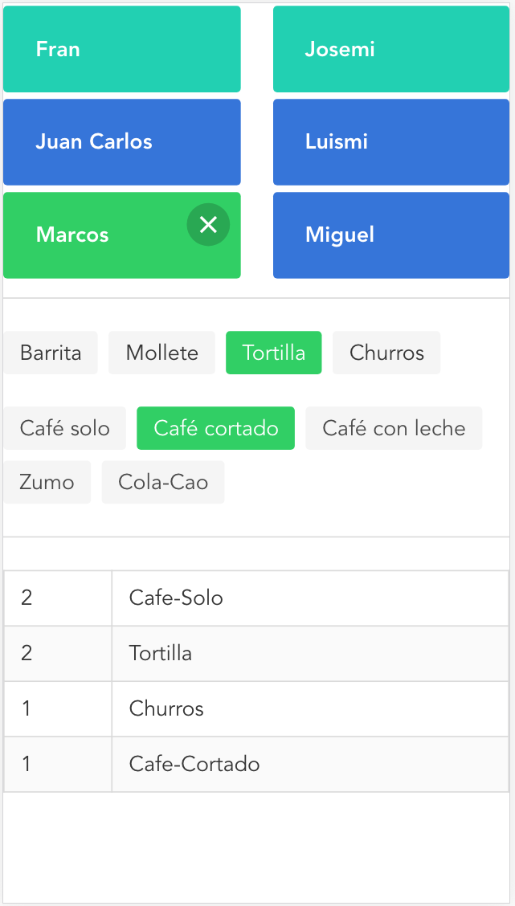

# mollete

[](https://travis-ci.org/Miguel-Herrero/mollete) [](https://nodesecurity.io/orgs/yo/projects/a3a9f44c-67eb-4a87-a192-3950af0c078e)
[](https://david-dm.org/Miguel-Herrero/mollete) [](https://david-dm.org/Miguel-Herrero/mollete?type=dev) [](https://badge.fury.io/gh/Miguel-Herrero%2Fmollete) [](https://github.com/Miguel-Herrero/mollete/issues) [](http://hits.dwyl.io/Miguel-Herrero/mollete) [](https://www.bithound.io/github/Miguel-Herrero/mollete) [](https://www.bithound.io/github/Miguel-Herrero/mollete/master/dependencies/npm) [](https://www.bithound.io/github/Miguel-Herrero/mollete/master/dependencies/npm) [](https://www.bithound.io/github/Miguel-Herrero/mollete)

Vuejs breakfast order app with Firestore synchronization.  Check a user, the food/drinks and have the **total order summary** at the bottom: ready to order!

## Features
- Firestore to have the data **synchronized in real-time**. Several users can modify their order without delay!
- Install it as iOS Home App (via Share menu in Safari), it opens without Navbar!!
- Served directly from GitHub pages!
- Bulma styling for quick prototyping.



## Build Setup

``` bash
# install dependencies
npm install

# serve with hot reload at localhost:8080
npm run dev

# build for production with minification
npm run build
```
